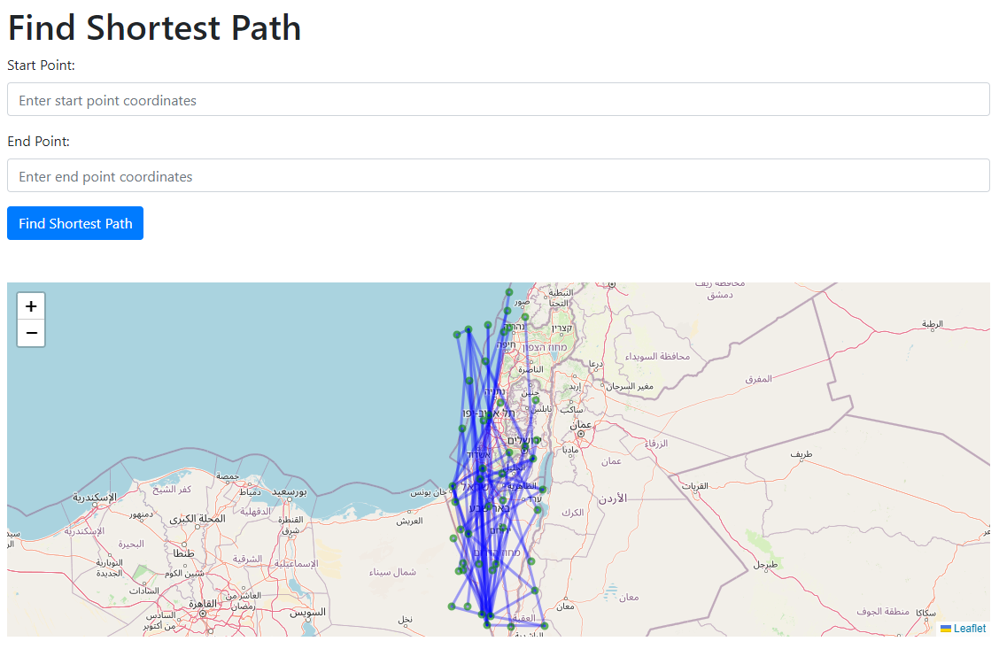

# **Graph-Based Route Finder**
 **The Mission:**\


## To install the Graph-Based Route Finder, please follow these steps:

1. Install the latest stable version of Python.
   
2. Install the Python requirements by running the following command in your terminal:
   
```bash
pip install -r requirements.txt
```
   It is recommended to install the requirements in a virtual environment.

## Usage

1. Activate the server by running the following command in your terminal :
```bash
python app.py
```
   
4. To access the user interface, go to http://localhost:5000/ in your web browser.
   
   The UI includes two input fields for starting and ending points,\
    each coordinates must include longitude and latitude, separated by comma ```Eg: 29.9,32.4```.   
5. To start calculate the shortest path press the `Find Shortest Path` Button.
6. Beneath the input area there is an interactive map with the Graph Vertecis in green dots & Graph paths in blue lines , Pressing each vertex will show a popup with the vertex coordinates.
7. Once the results are ready a `Download Kml` Button will appear, and pressing it will download the results in a KML file format to your local mechine.\
   The Results will be shown as an array of coordinates under the `Find Shortest Path` Button.\
   The map will also update with Markers for starting & ending points ,with the shortest path in red line.
\
\



7. Alternatively, you can send a POST request to http://localhost:5000/shortest_path with a JSON body containing the `start_point` and `end_point` key:value pairs.    
   The request headers should include  `Content-Type: application/json`.

   If the request is successful, you will receive a JSON response with the following keys:\
   `shortest_path`: array of coordinates from `start_point` to `end_point`.\
   `kml`: KML format representation of the shortest path.

## About the solution
Our goal is to find the shortest path on a graph without any prior knowledge. We don't know the distance from each vertex to the target, but we do know that there can't be a negative distance between vertices. Therefore, we will use the Dijkstra algorithm, which is named after [Edsger W. Dijkstra](https://en.wikipedia.org/wiki/Edsger_W._Dijkstra)

Here's how the Dijkstra algorithm works:
1. Since we don't know the distance from the starting point, we assume that the default distance to each vertex is infinity. We set the distance of the starting point to zero.
2. For each neighboring vertex of our current vertex, we calculate the distance from the starting point. If the calculated value is lower than the set value, we update the distance.
3. After setting the distance from the starting point to each neighboring vertex, we mark the current vertex as visited and move on to the nearest neighbor vertex.
4. We repeat this process until the target vertex is marked as visited. At that point, we know that we have found the shortest path.

<sub> [Dijkstra-Graph-Route-Finder](https://github.com/YohayHackam/Dijkstra-Graph-Route-Finder) © 2024 by [Yohay Hackam](https://www.linkedin.com/in/hackam-yohay/) is licensed under [CC BY-NC-ND 4.0](https://creativecommons.org/licenses/by-nc-nd/4.0/) 
</sub>
